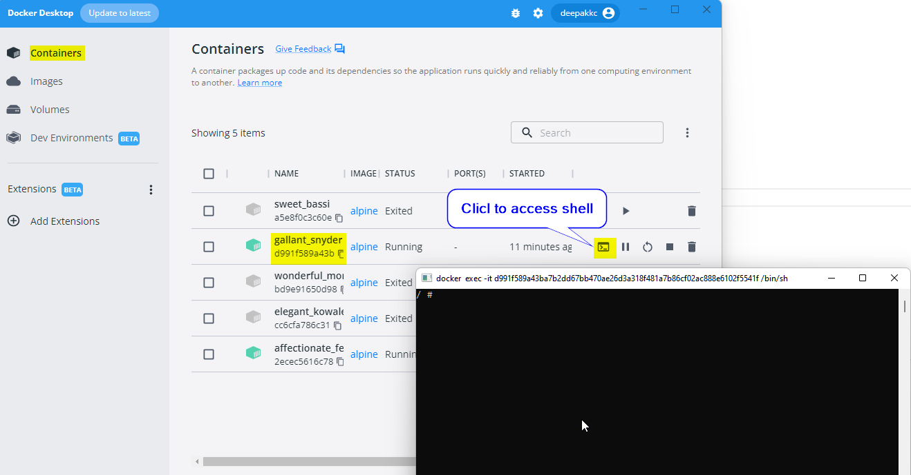
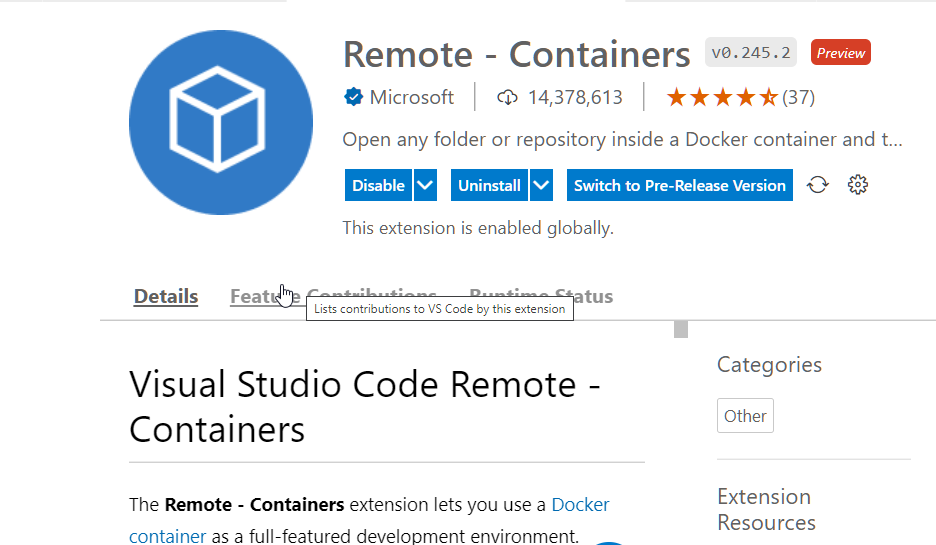
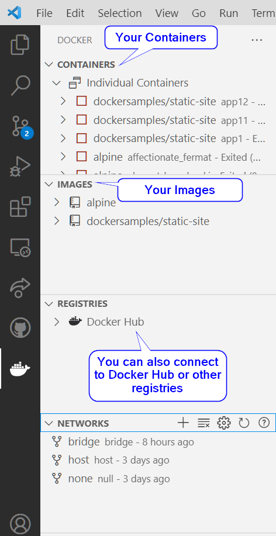

# Interacting with Docker Shell 
- Lets first create a Docker instance using an Alpine image. 
- To attach a shell, run the following command 
```
PS D:\github\OS22> docker run -it alpine /bin/sh
/ #
```
- To interact with the shell when the container is already running. 
```
PS D:\github\OS22> docker exec -it d991 /bin/sh
/ #
```
- To interact with the shell with Docker Desktop


## Managing Docker Containers

Lets run the following containers: 

`docker run --name app1 -d -p 88:80 dockersamples/static-site`

`docker run --name app2 -d -p 89:80 dockersamples/static-site`

Visit the following links: 
 - app1: [http://localhost:88/](http://localhost:88/)
 - app2: [http://localhost:89/](http://localhost:89/)

***To get a list of running containers : `docker ps`***
```
PS D:\github\OS22> docker ps
CONTAINER ID   IMAGE                       COMMAND                  CREATED       STATUS       PORTS                                   NAMES
5df0222c409e   dockersamples/static-site   "/bin/sh -c 'cd /usr…"   2 hours ago   Up 2 hours   443/tcp, 0.0.0.0:88->80/tcp             app1
5806d0aee950   dockersamples/static-site   "/bin/sh -c 'cd /usr…"   2 hours ago   Up 2 hours   80/tcp, 443/tcp, 0.0.0.0:8888->85/tcp   app2
```
***To Stop the container (app1) : `docker stop app1`*** You can stop a container with the container ID or the name. You need to type in only the first few letters of the container id. 
```
PS D:\github\OS22> docker stop app1
app1
```
***To show all the containers (includind non running containers):***
```
$ docker ps -a
```

***To  start container(s)***
```
$ docker start app1 app2
```

***To restart the  container***
```
$ docker restart app2
```
***To display the docker host information***
```
$ docker info
```

***To show the running processes in the  container `docker top container id or the name`***
```
$ docker top app1
```

***Retrieve the history of container `docker history ImageID/repository name`***
```
docker history 9c6

```

***To Inspect the image `docker inspect imageid/name`***
```
$ docker inspect 9c6
```

***Inspect one of the container and look for the internal ip***
```
$ docker inspect app1
```


***Show the logs of the second container using the flag --follow***
```
$ docker logs --follow app2
```

***Browse to the application and see the containers logs from the terminal***
[http://localhost:88](http://localhost:88)

***To stop  tracking logs***
```
$ CTRL + C
```
# Docker & Visual Studio Code
 - **Remote - Containers** extension in Visual Studio Code lets you use a Docker container as a full-featured development environment. 
 - You can  open any folder inside (or mounted into) a container.
 - You can easily switch between your containers and have full access to the tools, platform and file system.

 
 
 
# Docker Volumes