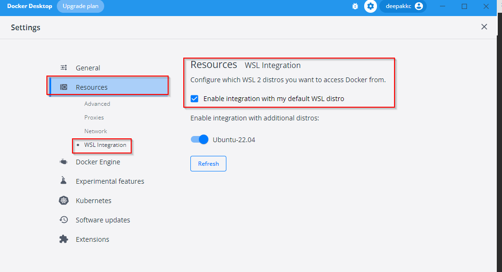
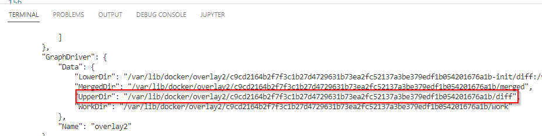
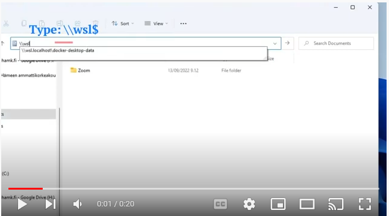

# Docker Volumes
# Updates Ongoing
In this tutorial, we will explore Docker volumes, a powerful feature that enables data persistence and sharing between Docker containers and the host system. 

## What is a Docker Volume? 

- A Docker Volume is a way to store and manage data separately from a Docker container. 
- A *[Docker Volume](https://docs.docker.com/storage/volumes/)* allows data to persist even after the containers are stopped or removed. 
- It provides durable and flexible storage solution for sharing data between containers and the host system. 
- Volumes are useful for preserving critical data like databases or application files, making it easier to manage and backup data in Docker environments.
- The another mechanism to persist data is [Bind Mounts](https://docs.docker.com/storage/bind-mounts/).

### Why to use Docker Volumes?

Docker volumes offer several benefits that significantly improve how we handle data within Docker containers. Some of the benefits are listed below: 

- **Data Persistence:** Keeping your data accessible and available for the duration of a container's life is one of the best features of Docker volumes. Your crucial data, such as databases or crucial application files, is thus safe even if you stop or remove the container. 

- **Data Sharing:** Volumes make it simple to share data between many containers. This is especially useful in configurations such as microservices architectures, where different portions of your app must communicate and share information. 

- **Backup and restore:** When it comes to backing up and restoring your data, Docker volumes come in handy. As your data is stored in a volume outside the container, you may quickly backup its contents from the host machine. This ensures the safety of your data, and if any unfortunate system failures or unanticipated issues emerge, you can immediately restore your vital data without much difficulty, minimizing downtime and preventing data loss.

- **Versioning and Upgrades:**  Docker volumes enable you separate your data from the containers, allowing you to update or replace containers without affecting your data. Your data remains consistent and compatible with later container versions, making upgrades quick and easy without the risk of data corruption or loss.

## Types of Docker Volumes

Docker provides various types of volumes, each with its own set of use cases and characteristics. Let's look at the three primary forms of Docker volumes:

 **Named Volumes:** A named volume in Docker is a user-defined volume with a specific name that provides a convenient way to persist and manage data separately from the containers. When you create them, you give them a unique name, and Docker manages their lifecycle. These volumes survive even after the related containers are removed, making them excellent for long-term data storage.

***How to create a named volume?***

You can create a named volume in Docker using the ```docker volume create``` command. 

**Example**
```bash
docker volume create my_named_volume
```

Lets confirm that the volume has been created. To list all the volumes that have been created on a Docker host, we can use the following command

```bash
docker volume ls
```

Let's create a container to persist MySQL database data and mount the named volume we just created. MySQL stores its database files in the ```/var/lib/mysql``` directory. 

```bash
docker run -d --name mysql_db -e MYSQL_ROOT_PASSWORD=12345678 -v my_named_volume:/var/lib/mysql mysql
```

**In this command:**

- `-d`: Runs the container in the background (detached mode).
- `--name mysql_db`: Specifies a custom name for the container (you can choose any name).
- `-e MYSQL_ROOT_PASSWORD=12345678`: Sets the root password for the MySQL database.
- `-v my_named_volume:/var/lib/mysql`: Mounts the named volume `mysql_data` to the `/var/lib/mysql` directory inside the container.
- `mysql`: Specifies the latest version of the MySQL image.


**Accessing MySQL Database**

Now that the MySQL container is running and is using the named volume, we can access the MySQL database 

```bash
# Connect to the MySQL database
docker exec -it mysql_db mysql -u root -p

# Lets create a couple of databases
create database db1; 
create database db2;

#lets check our databases
show databases; 

# To exit the MySQL 
exit;

```

> The named volume my_named_volume will store the MySQL data on the Docker host, inside the Docker volumes directory. This allows you to maintain the database data even if you stop or remove the MySQL container. 

Let's now delete the container and create a new one while using the same volume. This will help us verify if the data still exists within the volume after recreating the container.

```bash
# To force remove a Docker container
docker rm -f mysql_db

# To create a container and mount the volume that we created earlier. 
docker run -d --name mysql_db1 -e MYSQL_ROOT_PASSWORD=12345678 -v my_named_volume:/var/lib/mysql mysql

# Connect to the MySQL database
docker exec -it mysql_db1 mysql -u root -p

#lets check our databases
show databases; 

# you may exit the MySQL 
exit;
```

The databases we created earlier persist and remain available even after creating a new container. This demonstrates the power of using Docker volumes to ensure data persistence and accessibility across container lifecycle.

***Where is the named volume located?***

Named volumes are stored within the Docker host's filesystem. By default, Docker stores named volumes in the **/var/lib/docker/volumes** directory on Linux systems.
> However, the exact location may vary depending on your Docker installation and configuration.

## Creating and Managing Docker Volumes


## Using Docker Volumes in Containers

## Real World Example: Using Volume for MySQL databases.


***To make things clear, lets go through a simple demonstration of a volume***

- Run an interactive shell within an alpine container 
```docker
docker run -it alpine /bin/sh
```
- Lets create a new folder as mydata
    ```bash
        mkdir mydata
    ```
- Lets create a text file as hello.txt in 'mydata'
```bash
touch mydata/hello.txt
```
- Lets confirm the file is created. 
```bash
ls mydata
```
- Lets exit the container shell 
```docker
exit
```
 ***The container has now exited. Let's start the container again.***
```docker
docker start continerID
```
#### Let's access the shell and see what happens to the file we created earlier, the file is still there 
```bash
PS D:\github\OS22> docker exec -it 661 /bin/sh
/ # ls
bin     etc     lib     mnt     opt     root    sbin    sys     usr
dev     home    media   mydata  proc    run     srv     tmp     var
/ # ls mydata/
hello.txt
/ #
```
#### To access the file from the host machine in Windows 10/11 (Make sure that you have WSL integration checked as in the diagram below:)
 


Let’s inspect our container in order to get the location of the container’s layer. We can use the `inspect` command and then scroll into the output until the GraphDriver key.

```docker
docker container inspect yourcontainerid
```
Get the path of the file that is specified in *UpperDir* and copy the path
 

#### To access the directory or file from the Windows machine, type the command below: (please remember to replace the path with your own path)
```powershell 
PS D:\GitHubRepos\OS22> ls \\wsl.localhost\docker-desktop-data\data\docker\overlay2\c9cd2164b2f7f3c1b27d4729631b73ea2fc52137a3be379edf1b054201676a1b\diff\mydata

    Directory: \\wsl.localhost\docker-desktop-data\data\docker\overlay2\c9cd2164b2f7f3c1b27d4729631b73ea2fc52137a3be379edf1b054201676a1b\diff\mydata

Mode                 LastWriteTime         Length Name
----                 -------------         ------ ----
-----          13/09/2022     8.59              0 hello.txt
```
#### You can also access it from Windows file explorer. 

[](https://www.youtube.com/watch?v=-JKWxSPdwD4 "Click to Watch Video")

#### Now let's remove the container & try to access the path
```docker
PS D:\GitHubRepos\OS22> docker stop  661
661
PS D:\GitHubRepos\OS22> 
PS D:\GitHubRepos\OS22> docker rm 661
661
PS D:\GitHubRepos\OS22> ls \\wsl.localhost\docker-desktop-data\data\docker\overlay2\c9cd2164b2f7f3c1b27d4729631b73ea2fc52137a3be379edf1b054201676a1b\diff\mydata
Get-ChildItem: Cannot find path '\\wsl.localhost\docker-desktop-data\data\docker\overlay2\c9cd2164b2f7f3c1b27d4729631b73ea2fc52137a3be379edf1b054201676a1b\diff\mydata' because it does not exist.
PS D:\GitHubRepos\OS22> 

```
***It seems the folder defined in the UpperDir above does not exist anymore.  Try running the ls command again and see the results.***

>Note: The data created in a container is not persisted. It’s removed with the container’s layer when the container is deleted.To persis data, we will use volume.

# Creating a Docker Volume
- You can create Docker Volume in two different ways
    - Within a `Dockerfile` 
    ```
    VOLUME /mydata
    ```
    - With the Docker run command with the `-v` flag
    ```bash
    $ docker run -d -v /mydata myapp
    ```
##### In both cases, `/mydata` (inside the container) will be a volume.

***You can create and manage volumes that are outside the scope of any container***
```docker
docker volume create myvolume
```
### To list volumes
```docker
docker volume ls
```
### To inspect a volume 
```docker
docker volume inspect volumename
```
### To remove a volume 
```docker
docker volume rm volumename
```
### To remove (pruning) all unused volumes 
```docker
docker volume prune
```
### To start a container with a volume
When you start a container with a volume that does not exist, the Docker will create the volume for you. 
***Lets start alpine with a volume to which we will add persistent data.***

- Create a volume or use the existing one. Lets create a new volume called alpinedata
```docker
docker volume create alpinedata
```
- Create a Docker container & attach the alpinedata volume
```docker
docker run -it -v alpinedata:/data alpine /bin/sh
```
- Lets get to the data directory in container and create some files and ensure with ls command that the files are created.
```bash
touch data/file1.txt data/file2.txt
ls data
```
- Exit the container `exit`
- Delete the container `docker rm continaerid`

### Run a new container and attach the alpinedata volume to it. 
```bash
docker run -it -v alpinedata:/data alpine /bin/sh
```
#### [Read More on Volumes](https://docs.docker.com/storage/volumes/)

#### Check the files in the data directory and verify that they still exist 
```bash
ls data
```
## Creating Docker Volume within a **Dockerfile**

###### Content of the Dockerfile
```bash
FROM alpine:latest
RUN mkdir /data
WORKDIR /data
RUN echo "Hello from Volume" > test
VOLUME /data
CMD cat test
```
- Build the image `docker build . -t   vv`
- Run it `docker run vv`  
- Get the shell access and create some more files to it.
- Delete the container and run the image again by attaching the volume . 
- Check if your files still exist.

