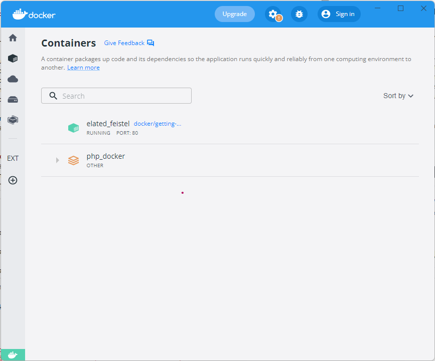

# Getting Started with Docker
This tutorial aims to guide you through the process of setting up Docker Desktop and understanding the fundamentals of Docker. By the end of this tutorial, you will be able to run, stop, and remove Docker containers. Let's get started! 

## Setting up your Computer

The *getting started* guide on Docker has detailed instructions for setting up Docker on [Mac](https://docs.docker.com/docker-for-mac/), [Linux](https://docs.docker.com/engine/installation/linux/) and [Windows](https://docs.docker.com/desktop/install/windows-install/).

*If you're using Docker for Windows* make sure you have [shared your drive](https://docs.docker.com/docker-for-windows/#shared-drives).

*Important note* If you're using an older version of Windows or MacOS you may need to use [Docker Machine](https://docs.docker.com/machine/overview/) instead.

*All commands work in either bash or Powershell on Windows*

## Check your Docker Installation
Once you are done installing Docker, test your Docker installation by running the following:

```
$ docker run hello-world
Unable to find image 'hello-world:latest' locally
latest: Pulling from library/hello-world
03f4658f8b78: Pull complete
a3ed95caeb02: Pull complete
Digest: sha256:8be990ef2aeb16dbcb9271ddfe2610fa6658d13f6dfb8bc72074cc1ca36966a7
Status: Downloaded newer image for hello-world:latest

Hello from Docker.
This message shows that your installation appears to be working correctly.
...
```
# The Docker Dashboard
It provides a quick view of the containers running on your machine. You have quick access to container logs, and you can get a shell inside the container. You can easily manage containers, such as stopping, starting, or removing them. 
.

# Running your first Container

In this section, you will run an [Alpine Linux](http://www.alpinelinux.org/) container (a lightweight Linux distribution) on your system and get familiar with the `docker run` command.

To get started, let's run the following in our terminal:
```
$ docker pull alpine
```

> **Note:** Depending on how you've installed docker on your system, you might see a `permission denied` error after running the above command. Try the commands from the Getting Started tutorial to [verify your installation](https://docs.docker.com/engine/getstarted/step_one/#/step-3-verify-your-installation). If you're on Linux, you may need to prefix your `docker` commands with `sudo`. Alternatively you can [create a docker group](https://docs.docker.com/engine/installation/linux/ubuntulinux/#/create-a-docker-group) to get rid of this issue.

The `pull` command fetches the alpine **image** from the **Docker registry** and saves it in your system. You can use the `docker images` command to see a list of all images on your system.
```
$ docker images
REPOSITORY              TAG                 IMAGE ID            CREATED             VIRTUAL SIZE
alpine                 latest              c51f86c28340        4 weeks ago         1.109 MB
hello-world             latest              690ed74de00f       5 months ago        960 B
```

### Docker Run
Great! Let's now run a Docker **container** based on this image. To do that you are going to use the `docker run` command.

```
$ docker run alpine ls -l
total 48
drwxr-xr-x    2 root     root          4096 Mar  2 16:20 bin
drwxr-xr-x    5 root     root           360 Mar 18 09:47 dev
drwxr-xr-x   13 root     root          4096 Mar 18 09:47 etc
drwxr-xr-x    2 root     root          4096 Mar  2 16:20 home
drwxr-xr-x    5 root     root          4096 Mar  2 16:20 lib
......
......
```
What happened? Behind the scenes, a lot of stuff happened. When you call `run`,
1. The Docker client contacts the Docker daemon.
2. The Docker daemon checks local store if the image (alpine in this case) is available locally, and if not, downloads it from Docker Store. (Since we have issued `docker pull alpine` before, the download step is not necessary)
3. The Docker daemon creates the container and then runs a command in that container.
4. The Docker daemon streams the output of the command to the Docker client

When you run `docker run alpine`, you provided a command (`ls -l`), so Docker started the command specified and you saw the listing.

Let's try something more exciting.

```
$ docker run alpine echo "hello from alpine"
hello from alpine
```
OK, that's some actual output. In this case, the Docker client dutifully ran the `echo` command in our alpine container and then exited it. If you've noticed, all of that happened pretty quickly. Imagine booting up a virtual machine, running a command and then killing it. Now you know why they say containers are fast!

Try another command.
```
$ docker run alpine /bin/sh
```

Wait, nothing happened! Is that a bug? Well, no. These interactive shells will exit after running any scripted commands, unless they are run in an interactive terminal - so for this example to not exit, you need to `docker run -it alpine /bin/sh`.

You are now inside the container shell and you can try out a few commands like `ls -l`, `uname -a` and others. Exit out of the container by giving the `exit` command.


Ok, now it's time to see the `docker ps` command. The `docker ps` command shows you all containers that are currently running.

```
$ docker ps
CONTAINER ID        IMAGE               COMMAND             CREATED             STATUS              PORTS               NAMES
```

Since no containers are running, you see a blank line. Let's try a more useful variant: `docker ps -a`

```
$ docker ps -a
CONTAINER ID        IMAGE               COMMAND                  CREATED             STATUS                      PORTS               NAMES
36171a5da744        alpine              "/bin/sh"                5 minutes ago       Exited (0) 2 minutes ago                        fervent_newton
a6a9d46d0b2f        alpine             "echo 'hello from alp"    6 minutes ago       Exited (0) 6 minutes ago                        lonely_kilby
ff0a5c3750b9        alpine             "ls -l"                   8 minutes ago       Exited (0) 8 minutes ago                        elated_ramanujan
c317d0a9e3d2        hello-world         "/hello"                 34 seconds ago      Exited (0) 12 minutes ago                       stupefied_mcclintock
```

What you see above is a list of all containers that you ran. Notice that the `STATUS` column shows that these containers exited a few minutes ago. You're probably wondering if there is a way to run more than just one command in a container. Let's try that now:

```
$ docker run -it alpine /bin/sh
/ # ls
bin      dev      etc      home     lib      linuxrc  media    mnt      proc     root     run      sbin     sys      tmp      usr      var
/ # uname -a
Linux 97916e8cb5dc 4.4.27-moby #1 SMP Wed Oct 26 14:01:48 UTC 2016 x86_64 Linux
```
Running the `run` command with the `-it` flags attaches us to an interactive tty in the container. Now you can run as many commands in the container as you want. Take some time to run your favorite commands.

 To find out more about `run`, use `docker run --help` to see a list of all flags it supports. As you proceed further, we'll see a few more variants of `docker run`.

# Terminology
In the last section, you saw a lot of Docker-specific jargon which might be confusing to some. So before you go further, let's clarify some terminology that is used frequently in the Docker ecosystem.

- *Images* - The file system and configuration of our application which are used to create containers. To find out more about a Docker image, run `docker inspect alpine`. In the demo above, you used the `docker pull` command to download the **alpine** image. When you executed the command `docker run hello-world`, it also did a `docker pull` behind the scenes to download the **hello-world** image.
- *Containers* - Running instances of Docker images &mdash; containers run the actual applications. A container includes an application and all of its dependencies. It shares the kernel with other containers, and runs as an isolated process in user space on the host OS. You created a container using `docker run` which you did using the alpine image that you downloaded. A list of running containers can be seen using the `docker ps` command.
- *Docker daemon* - The background service running on the host that manages building, running and distributing Docker containers.
- *Docker client* - The command line tool that allows the user to interact with the Docker daemon.
- *Docker Store* - A [registry](https://store.docker.com/) of Docker images, where you can find trusted and enterprise ready containers, plugins, and Docker editions. You'll be using this later in this tutorial.

# Exercise 
- Your task is to run a MySQL database service in a container.
- You need to find an appropriate MySQL image from the [Dockerhub](https://hub.docker.com/)
- You are required run the image in detached mode. (docker run )
>**Note:**  The `-d` flag enables **detached mode**, which detaches the running container from the terminal/shell and returns your prompt after the container starts. 
- Run `docker ps` to view the running containers.
- Stop the container that you have just launched. In order to do this, you need the container ID.
- Remove the container (docker rm )

>**Note:** It is not required to specify the entire `CONTAINER ID`. You can just specify a few starting characters and if it is unique among all the containers that you have launched, the Docker client will intelligently pick it up.

- Launch a container in detached mode 

```
$ docker run --name cname -e MYSQL_ROOT_PASSWORD=yourpassword -d mysql:tag

```
In the above command:

* `--name cname` : This sets the name of the container to "cname". You can use this name to easily refer to and manage the container later.
* `-e MYSQL_ROOT_PASSWORD=yourpassword` : This option sets an environment variable for the MySQL container. It sets the MYSQL_ROOT_PASSWORD variable to "yourpassword," which will be used as the root password for the MySQL database.
* `-d` will run the container in detached mode, meaning it will run in the background.
* `mysql:tag`: This part specifies the Docker image to use for the container. In this example, it uses the official MySQL image with a specific tag. The tag represents a specific version or variant of the MySQL image (e.g., latest, 8.0, 5.7, etc.).

***Remove all containers since you don't need them any more. Remember to stop before deleting a container*** 
```bash
- docker stop continaername/id
- docker remove continaername/id
```

## Docker Commands Cheat Sheet

Here is a list of commonly used Docker commands for managing containers:

- `docker start`: Start a stopped container.
  - Example: `docker start mycontainer`

- `docker stop`: Stop a running container.
  - Example: `docker stop mycontainer`

- `docker restart`: Stop and then start a container.
  - Example: `docker restart mycontainer`

- `docker rm`: Remove a container.
  - Example: `docker rm mycontainer`

- `docker ps`: List running containers.
  - Example: `docker ps`

- `docker ps -a`: List all containers (including stopped containers).
  - Example: `docker ps -a`

- `docker logs`: Display the logs of a container.
  - Example: `docker logs mycontainer`

- `docker exec`: Execute a command inside a running container.
  - Example: `docker exec -it mycontainer sh`

- `docker inspect`: Display detailed information about a container.
  - Example: `docker inspect mycontainer`

- `docker stats`: Display real-time resource usage statistics of running containers.
  - Example: `docker stats`

- `docker pause`: Pause the execution of processes in a running container.
  - Example: `docker pause mycontainer`

- `docker unpause`: Resume the execution of processes in a paused container.
  - Example: `docker unpause mycontainer`

- `docker top`: Display the running processes inside a container.
  - Example: `docker top mycontainer`

- `docker rename`: Rename a container.
  - Example: `docker rename mycontainer newname`

- `docker attach`: Attach to a running container to view its output or interact with its processes.
  - Example: `docker attach mycontainer`

  ## Docker Commands for Images

1. `docker images`: List all locally available Docker images.
   - Example: `docker images`

2. `docker pull`: Pull an image from a container registry.
   - Example: `docker pull nginx`

3. `docker build`: Build a Docker image from a Dockerfile.
   - Example: `docker build -t myapp:latest .`

4. `docker push`: Push an image to a container registry.
   - Example: `docker push myusername/myapp:latest`

5. `docker rmi`: Remove one or more Docker images from the local machine.
   - Example: `docker rmi myapp:latest`

6. `docker tag`: Tag an existing image to give it a new name or version.
   - Example: `docker tag myapp:latest myapp:v1.0`

7. `docker history`: Show the history of an image, including its layers and sizes.
   - Example: `docker history myapp:latest`

8. `docker inspect`: Display detailed information about an image.
   - Example: `docker inspect myapp:latest`

9. `docker search`: Search for Docker images in a public container registry like Docker Hub.
   - Example: `docker search ubuntu`

10. `docker save`: Save one or more images to a tar archive.
    - Example: `docker save -o my_images.tar myapp:latest myotherapp:latest`

11. `docker load`: Load an image or images from a tar archive.
    - Example: `docker load -i my_images.tar`

12. `docker prune`: Remove all unused images, networks, and containers (careful with this command).
    - Example: `docker system prune`